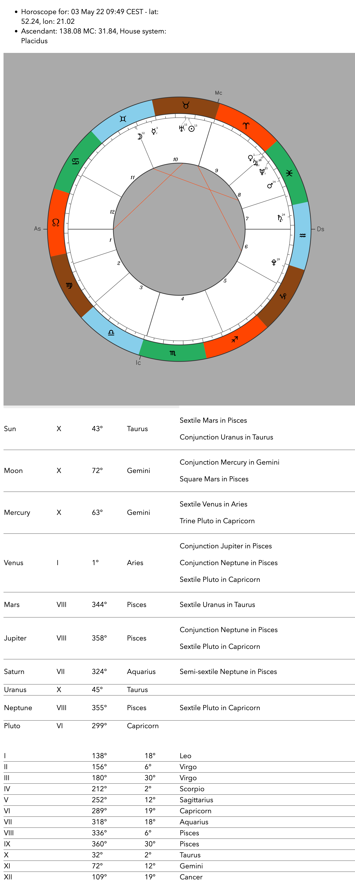

# GoHoroscopeCharts

http server in Golang for visualizing horoscope data (radix, transit, houses, planetary cycles, etc.) with an astrology charts using splendid [AstroChart](https://github.com/AstroDraw/AstroChart).

It is using [Swiss Ephemeris](https://www.astro.com/swisseph/swephprg.htm) underneath wraped with [swephgo](https://github.com/mshafiee/swephgo). You will need compiled Swiss Ephemem library and ephemeris files on your server. [Read here](https://github.com/chew-z/GoHoroscope) for instructions.

For CLI version check [GoHoroscope](https://github.com/chew-z/GoHoroscope).

